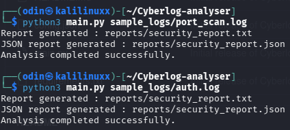
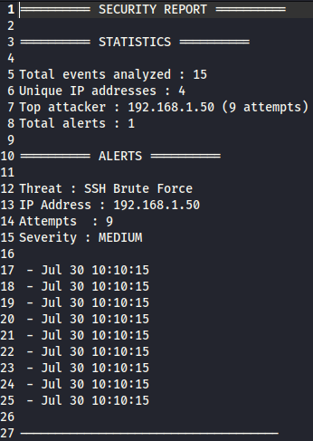
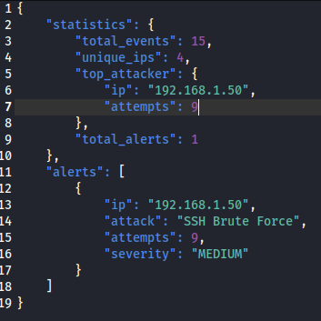

# 🔐 CyberLog Analyzer

A Python-based security log analyzer capable of detecting suspicious activities such as SSH brute force attacks and port scanning attempts.

The project parses log files, extracts relevant information, analyzes events, detects threats and generates security reports in TXT and JSON formats.

---

## 🚀 Features

### 🔎 Log Parsing

- Extract IP addresses
- Extract timestamps
- Extract connection ports
- Parse authentication logs

### 🛡️ Threat Detection

Currently supported detections:

### SSH Brute Force Detection

Detects repeated failed login attempts from the same IP address.

Example:


192.168.1.50 → 9 failed attempts
Severity: MEDIUM


### Port Scan Detection

Detects IP addresses scanning multiple ports.

Example:


192.168.1.80 → 5 ports scanned
Severity: HIGH


---

## 📊 Reports

The analyzer generates:

### Text Report


reports/security_report.txt


Example:


========== SECURITY REPORT ==========

Threat : Port Scan
IP Address : 192.168.1.80
Ports scanned : 5
Severity : HIGH


### JSON Report


reports/security_report.json


Example:

```json
{
    "alerts": [
        {
            "ip": "192.168.1.80",
            "attack": "Port Scan",
            "ports_scanned": 5,
            "severity": "HIGH"
        }
    ]
}


📂 Project Structure

CyberLog-Analyzer/
│
├── main.py
├── config.json
├── requirements.txt
│
├── sample_logs/
│   ├── auth.log
│   └── port_scan.log
│
├── reports/
│
└── src/
    ├── parser.py
    ├── detector.py
    ├── port_scanner.py
    ├── statistics.py
    ├── report.py
    └── exporter.py


⚙️ Installation

Clone the repository:

git clone https://github.com/your_username/CyberLog-Analyzer.git

Install dependencies:

pip install -r requirements.txt


▶️ Usage

Analyze a log file:

python3 main.py sample_logs/auth.log

or:

python3 main.py sample_logs/port_scan.log

The analyzer will generate security reports automatically.


🛠️ Technologies Used

- Python 3
- Regular Expressions (Regex)
- File Processing
- JSON
- Linux Logs
- Cybersecurity Concepts


🎯 Project Goals

This project was developed to practice:

- Python automation
- Security log analysis
- Threat detection logic
- Modular software architecture
- Cybersecurity monitoring concepts


📌 Future Improvements

- Add more attack detections
- Add command-line arguments
- Add unit tests
- Add database storage
- Add graphical dashboard

---

## Screenshots

### Terminal execution



### Security Report



### JSON Export



---
